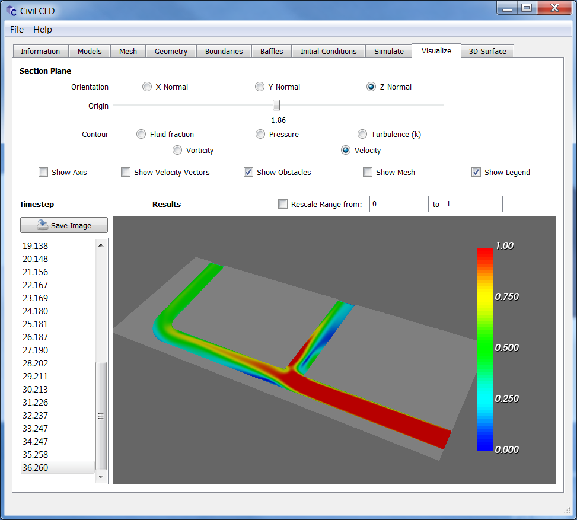

Civil-CFD allows civil engineering practioners to develop computational fluid dynamics (CFD) models of water infrastructure projects using a purpose built graphical solver.  

Key features of Civil-CFD include:
* Meshing tool that takes ASCII STL files as input to generate a 3D orthogonal mesh that preserves complex geometries
* Solver with VOF algorithm for free surface flow, and k-E turbulence model
* Parallel solver using PetSc and MPI that can scale up to many processors for fast simulations
* Graphical interface for rapid case development and simple visualization of results
* Direct integration with [Paraview](https://www.paraview.org) for complex visualization

Civil-CFD is written by [Michael Celli](https://www.linkedin.com/in/michael-celli-water-wastewater) and is Free Software licensed under the GNU General Public License Version 3.0 

## Installation

[Download](https://github.com/civilcfd/Civil-CFD/releases) the latest release of Civil-CFD.  The "[Civil-CFD-Win64.zip](https://github.com/civilcfd/Civil-CFD/releases/download/v0.1.1/Civil-CFD-Win64.zip)" file contains the latest 64-bit binary release for Windows.  The installation steps for Windows are as follows:

1. First download and install the latest version of [Paraview](https://www.paraview.org).  It is recommended to try running Paraview, as 3D features of Civil-CFD will not work if Paraview doesn't work.
2. Copy the "[Civil-CFD-Win64.zip](https://github.com/civilcfd/Civil-CFD/releases/download/v0.1.1/Civil-CFD-Win64.zip)" file to the install location and unzip the contents.  
3. Install the Microsoft Visual C++ redistributable by running the "vc_redist.x64.exe" file included. 
4. Install the Microsoft MPI runtime by running the "msmpisetup.exe" file included.
5. Run the Civil-CFD.exe file to open the graphical interface.

The software may also be built from source using CMake for either Linux or Windows.

## Getting Started

It is recommended that first time users open and run some of the example simulations to understand how to build cases.  Under the File menu, click the Open button to open a pre-existing case.  Civil-CFD stores cases as whole directories, so navigate to one of the example directories to open the associated case.  

The example cases are ready to simulate as provided.  To run a simulation, click on the Simulate tab, and then click the Simulate button.  Note the Pump Station example requires 12 GB installed RAM to run, whereas the Bump and Pipe Junction examples only require 4 GB installed.  When the simulation is complete the results can be visualized in the Visualize and 3D Surface tabs, or using Paraview by clicking the Information tab, selecting the timesteps of interest, and then clicking Open in Paraview.  

When working on a new case, the default simulation parameters generally do not need to be changed.  The steps for creating a new simulation include:

1. Define fluid properties and activate turbulence model if applicable 
2. Set the mesh properties including the size, number of cells, and origin
3. Load the geometry definition file (in ASCII STL format - binary STL must be converted first)
4. Render the mesh
5. Define the boundary conditions
6. Define the initial conditions
7. Set the simulation end time, write interval and number of processors
8. Run the simulation
9. Visualize the results

Each of above steps are performed using the tabs in the graphical interface in order from left to right.

## Screenshot

Civil-CFD in action showing a visualization of a section cut from the included Pipe Junction example:

## Requirements

Civil-CFD requires a 64-bit Linux or Windows installation.  Windows version 7 or higher is supported.  Minimum RAM to run the software is 4 GB, but 12 GB is recommended and required for the included "Pump Station" example.  3D graphics capability is required and most hardware is supported (integrated Intel HD graphics, AMD, or NVidia).  OpenGL version 3.2 or higher is required for the software to work without issues displaying the 3D enabled tabs (Mesh, Geometry, Boundaries, Baffles, etc.)

## License and Disclaimer

Civil-CFD
Free Surface CFD Solver for Civil Engineering Problems
Copyright (c) 2018 by [Michael Celli](https://www.linkedin.com/in/michael-celli-water-wastewater)
Released under the GNU GPL v. 3.0 

* VTK is Copyright (c) 1993-2018 Ken Martin, Will Schroeder, Bill Lorensen
* The Qt GUI Toolkit is Copyright (c) 2018 The Qt Company Ltd.
* Qhull is Copyright (c) 1993-2018 C.B. Barber and the The Geometry Centre
* QCustomPlot is Copyright (c) 2018 Emanuel Eichhammer
* libxml2 is Copyright (c) 1998-2018 by Daniel Veillard
* zlib is Copyright (c) 1995-2018 by Jean-loup Gailly and Mark Adler
* PETSc is Copyright (c) 1991-2018, UChicago Argonne, LLC and the [PETSc Development Team](http://www.mcs.anl.gov/petsc/miscellaneous/index.html)

The author(s) of Civil-CFD provide the program 'as is' without warranty of any kind, expressed or implied, including, but not limited to, the implied warranties of merchantability and fitness for a particular purpose. In no event shall the author(s) of Civil-CFD be liable for any direct, indirect, incidental, special, exemplary, or consequential damages (including, but not limited to, procurement of substitute goods or services; loss of use, data or profits; or business interruption) however caused and on any theory of liability, whether in contract, strict liability, or tort (including negligence or otherwise) arising in any way out of the use of this software, even if advised of the posibility of such damage.  

Civil-CFD is an open source framework for numerical simulation of differential equations using finite difference methods. The methods, equations, and theory applied in this software are outlined in the source files that are made available to the user for study or modification. The procedures applied in the software and detailed in the code have not been validated by physical modeling and therefore the software outputs should only be used for educational purposes and the accuracy of the results cannot be guaranteed. Practicioners using this software must apply their own professional judgement when interpreting the results, and take sole responsibility for professional decisions made based on use of this software. The author(s) of this software shall not be liable for professional decisions made based on results obtained from this software, including results that may be erroneous due to errors and omissions in the code. By using this software, you agree not to hold the author(s) liable for any injury or cost to any party from using this software or relying on its results.

